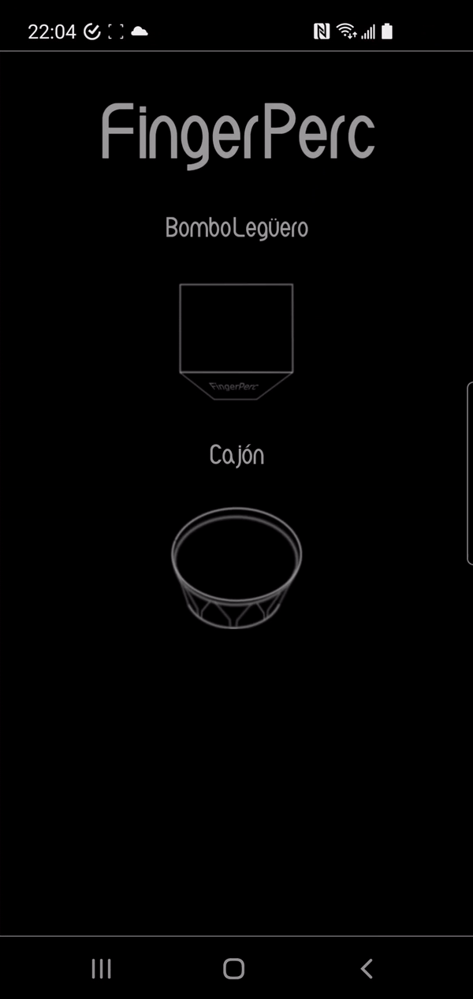

<h1 align="center">PAWKIT</h1>

 An interface for playing drums and percussion on a touchscreen   that enables <em>highly dynamic control</em> and follows   industry standard techniques for audio sampling .    
 

_____

# Abstract

PAWKIT is a musical instrument in the form of an Android app. It's a dynamic, zone-based percussion interface,
packaged with deep-sampled acoustic percussion instruments and drum kits. A user can load an instrument and then
create sound by tapping the screen. For each instrument, there are two zones on the screen which represent the
primary sounds that the instrument can make. For example, in the case of the Bombo Legüero,
those two sounds are 1) a hit on the wooden rim of the drum and 2) a hit in the center of the drum head
(membrane, that is). In the case of a drum kit, the two zones correspond to the snare drum and the kick drum.
The dynamic level of each hit
(the volume, basically) is determined by where you tap on the Y axis.
If you'd like a more detailed overview of the app, along with a demo, [watch this video!](https://youtu.be/RQXtMMSJ8G4)

# Under the hood

PAWKIT installs with hundreds of audio samples which are
individually triggered when a user touches various zones on the screen. As mentioned above,
each instrument has two principal sounds, often referred to as "articulations", and each corresponding
to a zone which occupies half of the device's screen. Within each articulation zone, there are many
subzones, generated automatically based on the provided sample set, and those each correspond to a
different volume for that articulation. Volume levels are more precisely referred to as "Velocities" hereafter.
While velocity level is the deepest level of detail that the user can control, there is another
layer of depth to the sample set. That layer is made of groups of recorded audio samples
where I played the drum at an identical volume, but allowed human imperfection.
These repetitions are called "Round Robins" in the audio sample industry, and
I recorded up to 10 of them for each velocity layer.
When a user triggers the exact same zone multiple times in a row, programming logic
chooses any round robin from those available, excluding the last one played, and submits its choice to the Player service.
The reason that RoundRobins are used is to avoid the dreaded "machine gun effect" that happens in
virtual instruments of lower quality. I provide a more detailed look at technical details of the app
in [this video.](https://youtu.be/6Hf7qcKE2H8)

# Status

The first test build of the app is complete and has been released for internal testing.

# Tech used/dependencies
- In-app updates
- In-app purchases
- Firebase
- Google Analytics
- [Google Oboe](https://github.com/google/oboe)
- CMake
- JNI
- JUnit
- Mockito
- PlantUML for docs
- [YouTube library by PierFranciscoSoffriti](https://github.com/PierfrancescoSoffritti/android-youtube-player)

# Architecture

[On this page, ](./app/Documentation/RenderedImages/RenderedImages.md) I've provided some 
notes and diagrams that describe how the whole project works, and it should
greatly help anyone who wants to dig in.  
